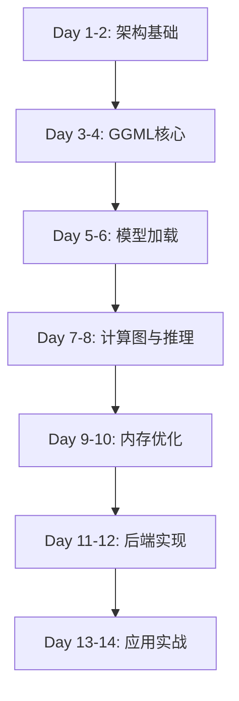

# llama.cpp 深度学习课程 - 14天精通之旅

欢迎来到 llama.cpp 深度学习课程！这个为期14天的课程将带你从零开始，深入理解 llama.cpp 的底层实现原理。

## 课程概览

### 📚 第一阶段：基础篇（Day 1-4）
- **Day 1**: [项目架构与设计哲学](day01-project-architecture.md)
- **Day 2**: [GGML张量库基础](day02-ggml-basics.md)
- **Day 3**: [张量操作与计算图](day03-tensor-operations.md)
- **Day 4**: [GGML内存管理机制](day04-ggml-memory.md)

### 🏗️ 第二阶段：模型加载篇（Day 5-6）
- **Day 5**: [GGUF文件格式详解](day05-gguf-format.md)
- **Day 6**: [模型加载与权重管理](day06-model-loading.md)

### 🚀 第三阶段：推理核心篇（Day 7-10）
- **Day 7**: [计算图构建与调度](day07-computation-graph.md)
- **Day 8**: [Transformer架构实现](day08-transformer-impl.md)
- **Day 9**: [KV缓存机制详解](day09-kv-cache.md)
- **Day 10**: [注意力机制优化](day10-attention-optimization.md)

### ⚡ 第四阶段：高性能篇（Day 11-12）
- **Day 11**: [CPU后端与SIMD优化](day11-cpu-backend.md)
- **Day 12**: [GPU后端实现（CUDA/Metal）](day12-gpu-backend.md)

### 🎯 第五阶段：应用篇（Day 13-14）
- **Day 13**: [采样策略与生成控制](day13-sampling.md)
- **Day 14**: [工具链与实战应用](day14-tools-practice.md)

## 学习路径



## 学习建议

### 📖 准备工作
1. **环境搭建**：确保已经成功编译 llama.cpp
2. **工具准备**：
   - 代码编辑器（VSCode推荐）
   - 调试工具（gdb/lldb）
   - 性能分析工具（perf/Instruments）
3. **基础知识**：
   - C/C++ 编程经验
   - 基本的深度学习概念
   - Transformer架构了解

### 🎯 学习方法
1. **每天安排**：
   - 阅读理论（30分钟）
   - 代码分析（60分钟）
   - 实践练习（30分钟）
   - 总结复习（15分钟）

2. **实践建议**：
   - 结合课程内容阅读源代码
   - 使用调试器跟踪执行流程
   - 尝试修改代码观察效果
   - 记录学习笔记

3. **进阶技巧**：
   - 对比不同模型的实现差异
   - 分析性能瓶颈并优化
   - 参与社区讨论
   - 阅读相关论文

## 代码导航

### 核心目录结构
```
llama.cpp/
├── include/llama.h          # 主API接口
├── src/                     # 核心实现
│   ├── llama.cpp           # 主入口
│   ├── llama-model.cpp     # 模型实现
│   ├── llama-context.cpp   # 上下文管理
│   ├── llama-kv-cache.cpp  # KV缓存
│   └── llama-sampling.cpp  # 采样策略
├── ggml/                    # 张量库
│   ├── include/ggml.h      # GGML API
│   └── src/ggml.c          # GGML实现
└── tools/                   # 工具集
    ├── cli/                # 命令行工具
    ├── server/             # HTTP服务器
    └── quantize/           # 量化工具
```

### 关键文件速查
| 文件 | 行数 | 主要功能 |
|-----|------|---------|
| `src/llama-model.cpp` | ~15000 | 模型加载、架构定义 |
| `src/llama-context.cpp` | ~4000 | 推理上下文管理 |
| `src/llama-kv-cache.cpp` | ~2500 | KV缓存实现 |
| `ggml/src/ggml.c` | ~18000 | 张量操作核心 |
| `ggml/src/ggml-backend.cpp` | ~3000 | 后端抽象层 |

## 配套资源

### 📚 参考文档
- [官方文档](https://github.com/ggml-org/llama.cpp)
- [GGML文档](https://github.com/ggml-org/ggml)
- [GGUF规范](https://github.com/ggml-org/ggml/blob/master/docs/gguf.md)

### 💡 推荐论文
- **Transformer**: "Attention Is All You Need" (Vaswani et al., 2017)
- **LLaMA**: "LLaMA: Open and Efficient Foundation Language Models" (Touvron et al., 2023)
- **FlashAttention**: "FlashAttention: Fast and Memory-Efficient Exact Attention" (Dao et al., 2022)
- **Quantization**: "LLM.int8(): 8-bit Matrix Multiplication for Transformers" (Dettmers et al., 2022)

### 🔧 调试技巧
```bash
# 启用详细日志
export LLAMA_LOG_LEVEL=debug

# 使用gdb调试
gdb --args ./build/bin/llama-cli -m model.gguf

# 性能分析
perf record -g ./build/bin/llama-cli -m model.gguf
perf report
```

## 进度追踪

建议每天学完后在这里打勾：

- [ ] Day 1: 项目架构与设计哲学
- [ ] Day 2: GGML张量库基础
- [ ] Day 3: 张量操作与计算图
- [ ] Day 4: GGML内存管理机制
- [ ] Day 5: GGUF文件格式详解
- [ ] Day 6: 模型加载与权重管理
- [ ] Day 7: 计算图构建与调度
- [ ] Day 8: Transformer架构实现
- [ ] Day 9: KV缓存机制详解
- [ ] Day 10: 注意力机制优化
- [ ] Day 11: CPU后端与SIMD优化
- [ ] Day 12: GPU后端实现
- [ ] Day 13: 采样策略与生成控制
- [ ] Day 14: 工具链与实战应用

## 常见问题

<details>
<summary>Q: 需要什么样的硬件配置？</summary>

**最低配置**：
- CPU: x86_64 或 ARM64
- 内存: 8GB RAM
- 存储: 10GB 可用空间

**推荐配置**：
- CPU: 支持AVX2的现代处理器
- 内存: 16GB+ RAM
- GPU: NVIDIA GPU (CUDA支持) 或 Apple Silicon (Metal支持)
- 存储: SSD
</details>

<details>
<summary>Q: 学完课程能达到什么水平？</summary>

完成本课程后，你将能够：
- ✅ 深入理解LLM推理的底层原理
- ✅ 阅读并修改llama.cpp源代码
- ✅ 添加新的模型支持
- ✅ 实现自定义优化
- ✅ 开发基于llama.cpp的应用
</details>

<details>
<summary>Q: 遇到问题怎么办？</summary>

**资源渠道**：
1. 查看课程中的代码注释
2. 参考官方文档和Issues
3. 使用调试工具单步跟踪
4. 在GitHub Discussions提问
5. 加入社区交流群
</details>

## 贡献

如果你发现课程中的错误或有改进建议，欢迎：
- 提交Issue
- 发起Pull Request
- 分享学习心得

## 许可

本课程基于MIT许可证开源，与llama.cpp项目保持一致。

---

**准备好了吗？让我们从 [Day 1](day01-project-architecture.md) 开始这段激动人心的学习之旅！** 🚀
